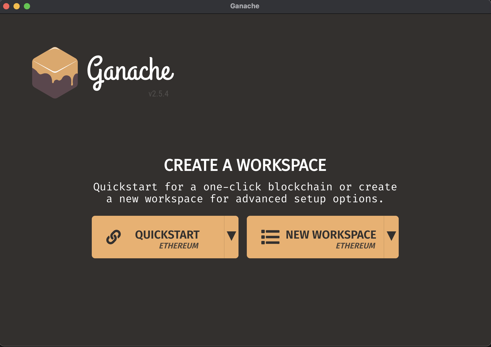
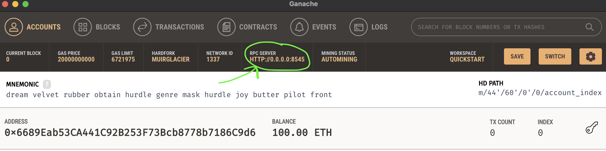
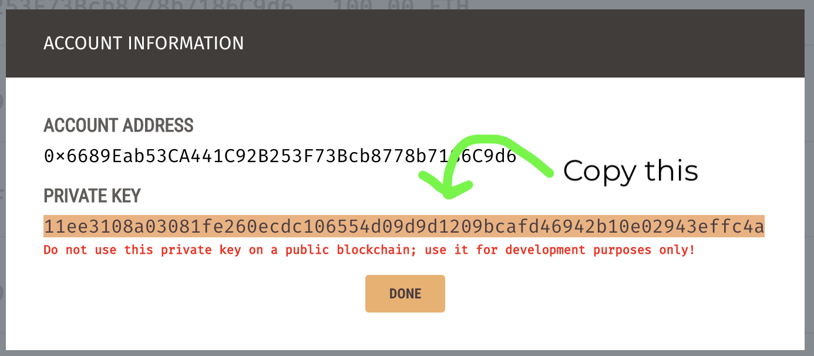

# Ethers Simple Storage

This is part of the FreeCodeCamp Solidity & Javascript Blockchain Course.

Video Link : *[⌨️ (05:30:42) Lesson 5: Ethers.js Simple Storage](https://www.youtube.com/watch?v=gyMwXuJrbJQ&t=19842s)*


# Getting Started

## Requirements

- [git](https://git-scm.com/book/en/v2/Getting-Started-Installing-Git)
  - You'll know you did it right if you can run `git --version` and you see a response like `git version x.x.x`
- [Nodejs](https://nodejs.org/en/)
  - You'll know you've installed nodejs right if you can run:
    - `node --version` and get an ouput like: `vx.x.x`
- [Yarn](https://classic.yarnpkg.com/lang/en/docs/install/) instead of `npm`
  - You'll know you've installed yarn right if you can run:
    - `yarn --version` and get an output like: `x.x.x`
    - You might need to install it with npm
- [ganache](https://trufflesuite.com/ganache/)
  - You'll know you did it right if you can run the application and see:
    <br>
    
  - You can alternatively use [ganache-cli](https://www.npmjs.com/package/ganache-cli) or [hardhat](https://hardhat.org/)

### Optional Gitpod

If you can't or don't want to run and install locally, you can work with this repo in Gitpod. If you do this, you can skip the `clone this repo` part.

[](https://gitpod.io/#github.com/PatrickAlphaC/ethers-simple-storage-fcc)

## Setup

Clone this repo

```
git clone https://github.com/PatrickAlphaC/ethers-simple-storage
cd ethers-simple-storage
```

Then install dependencies

```
yarn
```

> Note: You'll notice in our `package.json` we are using `"solc": "0.8.7-fixed"`. Usually, you'll just be able to do `"solc": "0.8.7"` to get a specific version, but there was a bit of an issue with that one... You'll find out why we use 0.8.7

### Typescript

If you like `typescript`, run `git checkout typescript` then run `yarn`

## Usage

1. Run your ganache local chain, by hitting `quickstart` on your ganache application

> Save the workspace. This way, next time you open ganache you can start the workspace you've created, otherwise you'll have to redo all the steps below.

2. Copy the `RPC SERVER` sting in your ganache CLI, and place it into your `.env` file similar to what's in `.env.example`.



`.env` Example:

```
RPC_URL=http://0.0.0.0:8545
```

3. Hit the key on one of the accounts, and copy the key you see and place it into your `.env` file, similar to what you see in `.env.example`.




`.env` Example:

PRIVATE_KEY=11ee3108a03081fe260ecdc106554d09d9d1209bcafd46942b10e02943effc4a

4. Compile your code

Run

```
yarn compile
```

You'll see files `SimpleStorage_sol_SimpleStorage.abi` and `SimpleStorage_sol_SimpleStorage.bin` be created.

5. Run your application

```
node deploy.js
```
### For WSL users

1. Run
```
yarn add ganache
```

2. Change Server settings in Ganache

Settings > Server > Host Name 

Change Host Name to vEthernet (WSL)

3. Run your application 

``` 
node deploy.js
```


### Deploying to a testnet

Make sure you have a [metamask](https://metamask.io/) or other wallet, and export the private key.

**IMPORTANT**

USE A METAMASK THAT DOESNT HAVE ANY REAL FUNDS IN IT. Just in case you accidentally push your private key to a public place. I _highly_ recommend you use a different metamask or wallet when developing.

1. [Export your private key](https://metamask.zendesk.com/hc/en-us/articles/360015289632-How-to-Export-an-Account-Private-Key) and place it in your `.env` file, as done above.

2. Go to [Alchemy](https://alchemy.com/?a=673c802981) and create a new project on the testnet of choice (ie, kovan or Rinkeby)
3. Grab your URL associated with the testnet, and place it into your `.env` file.
4. Make sure you have [testnet ETH](https://faucets.chain.link/) in your account. You can [get some here](https://faucets.chain.link/). You should get testnet ETH for the same testnet that you made a project in Alchemy (ie, Rinkeby or Kovan)
5. Run

```
node deploy.js
```

# Thank you!

If you appreciated this, feel free to follow me or donate!

ETH/Polygon/Avalanche/etc Address: 0x9680201d9c93d65a3603d2088d125e955c73BD65

[](https://twitter.com/PatrickAlphaC)
[](https://www.youtube.com/channel/UCn-3f8tw_E1jZvhuHatROwA)
[](https://www.linkedin.com/in/patrickalphac/)
[](https://medium.com/@patrick.collins_58673/)
